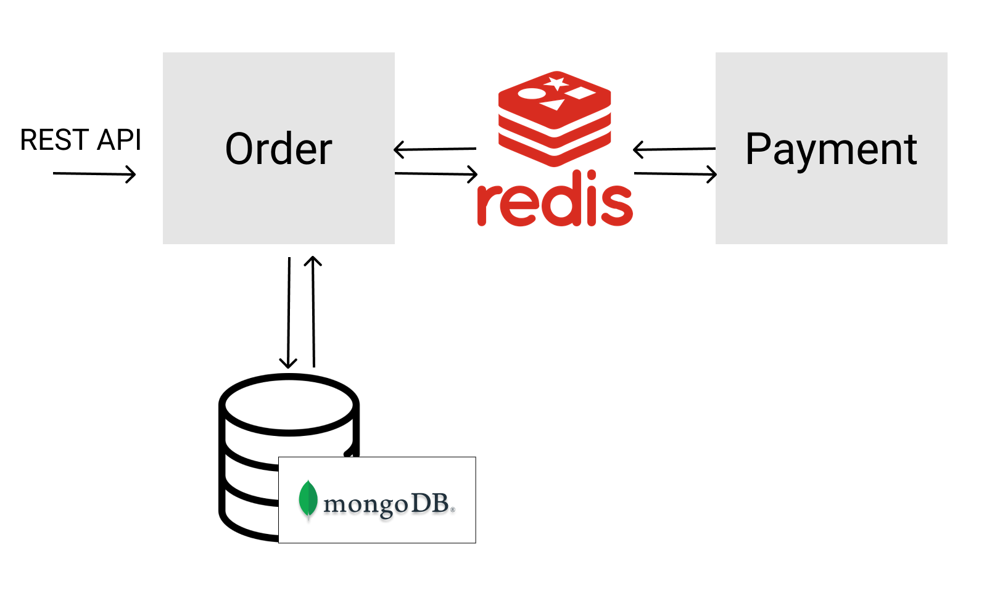

# done



## Installation

There are two ways to install dependencies and run this application:

<details>
   <summary>Using Docker (recommended)</summary>

At the root of this project, run the following command:

```bash
docker-compose up
```

</details>

<details>
   <summary>Manual</summary>

1. Install MongoDB
1. Install Redis
1. Add a `.env` at the root of the project with the following content:

   ```
   REDIS_URL=redis://localhost:6379
   ORDER_MONGODB_URL=mongodb://localhost/order
   ```

1. Install dependencies of project:

   ```bash
   yarn
   ```

1. Run the following command to start the order service:

   ```bash
   yarn start:order:dev
   ```

1. In another terminal, run the following command to start the payment service:

   ```bash
   yarn start:payment:dev
   ```

</details>

## API

Once you start the server, you can access the Swagger UI at localhost:3000/api

You can get the Swagger JSON file at `/api-json`.
